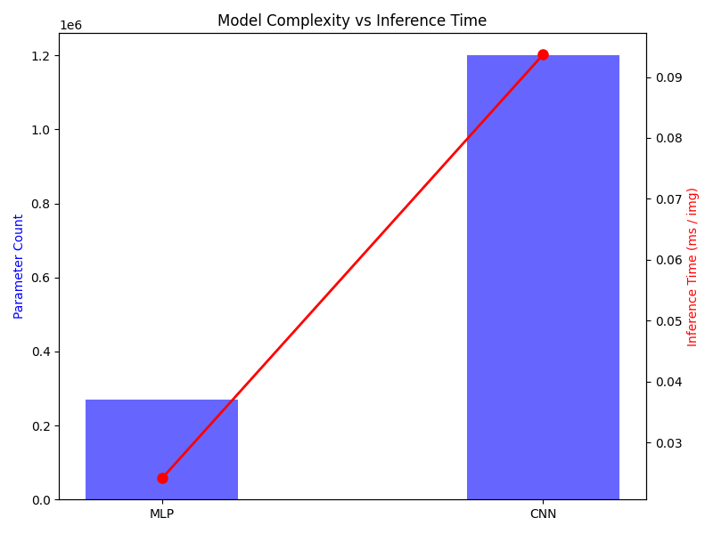
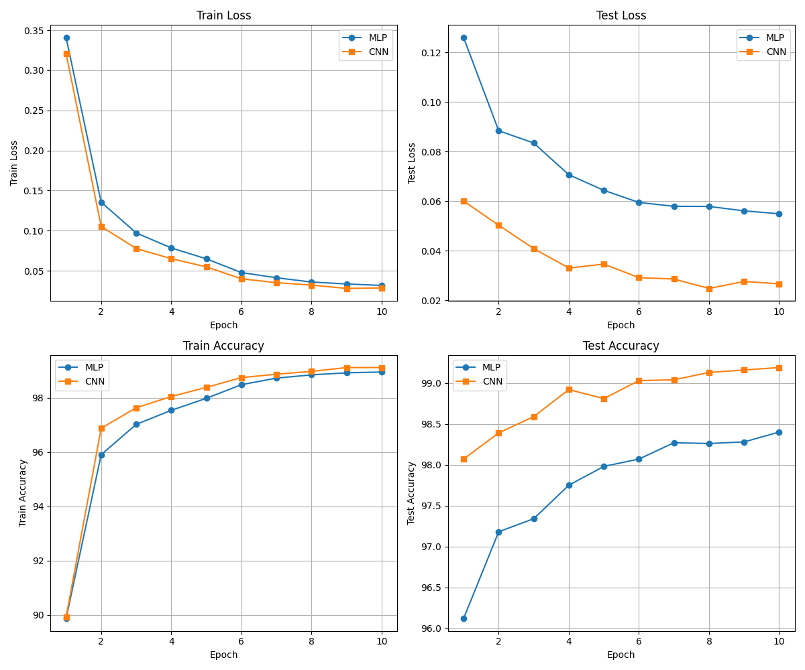
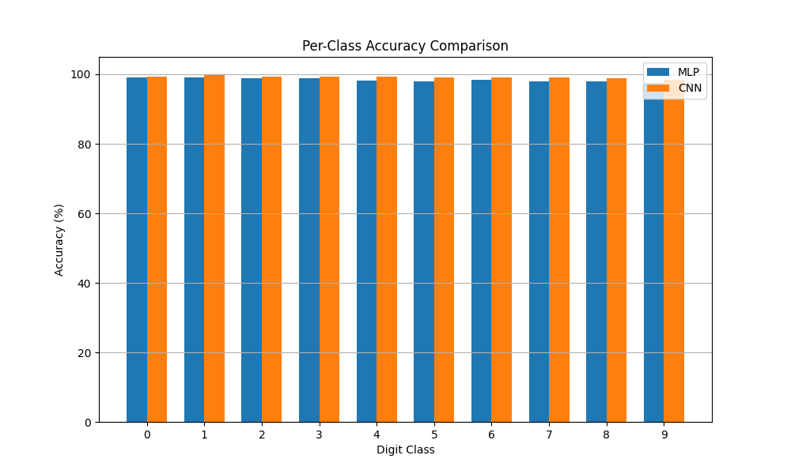
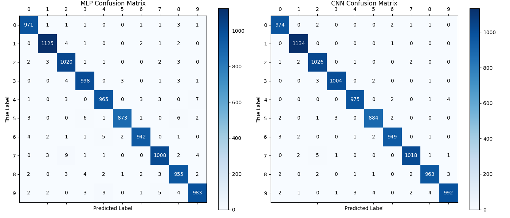
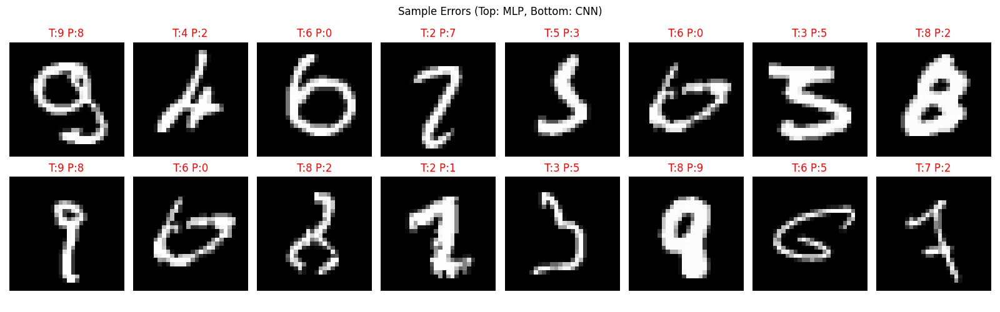
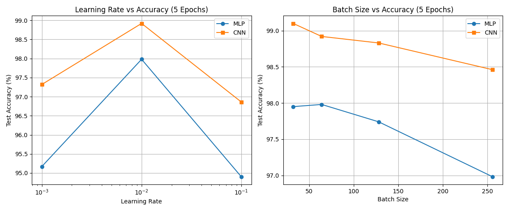

# 基于MNIST数据集的MLP与CNN手写数字识别对比实验报告

课程名称：人工智能导论

## 一、主要代码说明与算法流程介绍

### 1.1 项目概述

本项目基于PyTorch框架，针对MNIST手写数字数据集（含60000张训练图片与10000张测试图片，均为28×28灰度图像），分别实现了多层感知机（MLP）和卷积神经网络（CNN）两种分类模型，并进行了多维度对比实验。项目代码参考了开源项目pytorch-playground的基本结构，由`dataset.py`、`model.py`、`train.py`、`utils.py`和`compare.py`五个核心模块组成。

### 1.2 数据预处理

数据加载模块（`dataset.py`）通过torchvision自动获取MNIST数据集，对原始像素值执行两步预处理：首先将整数像素值[0, 255]转换为浮点张量[0.0, 1.0]；随后使用MNIST全局统计量（均值0.1307、标准差0.3081）进行标准化，使输入数据近似服从标准正态分布，有利于加速网络收敛。

### 1.3 模型结构

**MLP模型**：将28×28图像展平为784维向量后，依次经过两个全连接隐藏层（各256个神经元），每层后接ReLU激活函数和Dropout（丢弃率0.2），最终通过输出层映射到10个类别。可训练参数量约为269,322。

**CNN模型**：采用LeNet风格架构，输入为1×28×28的二维图像。首先经过两个卷积层（3×3卷积核，通道数分别为32和64），每层后接ReLU激活；随后通过2×2最大池化层和Dropout（丢弃率0.25）进行降维和正则化；最后将特征图展平，经128维全连接层（Dropout 0.5）输出10类预测。可训练参数量约为1,199,882。

### 1.4 训练流程

训练过程遵循标准的监督学习范式：每个epoch中，对每个mini-batch执行前向传播计算交叉熵损失，再通过反向传播算法（链式法则）求得各参数梯度，最后由SGD优化器（动量0.9、权重衰减1e-4）更新参数。学习率通过StepLR调度器每5个epoch衰减为原来的0.5倍。训练过程中记录损失和准确率等指标，保存测试集上表现最好的模型权重。

对比实验脚本（`compare.py`）统一调度两个模型的训练与评估流程，并额外执行了学习率（0.001、0.01、0.1）和批次大小（32、64、128、256）的超参数扫描实验，最终自动生成训练曲线、混淆矩阵、逐类别准确率等可视化图表。

## 二、实验结果分析

### 2.1 整体性能对比

在默认超参数（lr=0.01, batch_size=64, epochs=10）下，两个模型的核心指标对比如表1所示：

**表1 MLP与CNN性能对比**

| 指标 | MLP | CNN |
|------|-----|-----|
| 测试集准确率 | 98.40% | 99.19% |
| 可训练参数量 | 269,322 | 1,199,882 |
| 训练总耗时(10轮) | 86.3秒 | 572.8秒 |
| 单图推理时间 | 0.024 ms | 0.094 ms |

CNN准确率比MLP高出0.79个百分点，代价是参数量增至约4.5倍、训练时间增至约6.6倍。这表明卷积操作通过局部感受野和参数共享有效提取了图像的空间特征，在空间结构敏感的任务中具有显著优势。

### 2.2 训练收敛分析

从训练曲线（图1）可见，CNN的测试损失从第1轮起就低于MLP，且下降更平滑。MLP的测试损失在第3轮后趋于平缓（约0.08→0.055），而CNN持续下降至0.027，说明CNN的特征表达能力更强，在相同训练轮次内能获得更低的泛化误差。

### 2.3 逐类别准确率与混淆矩阵

逐类别分析显示，CNN在所有数字类别上的准确率均超过98.3%，而MLP在数字"9"（97.42%）和"5"（97.87%）上表现相对较弱。结合混淆矩阵可知，MLP将"4"误判为"9"共9次，"5"误判为"3"共6次——这些数字在手写形态上具有相似的笔画结构，MLP由于丢失了空间位置信息而更易混淆。

### 2.4 超参数影响

学习率扫描结果表明，两个模型均在lr=0.01时取得最佳表现（MLP 97.98%，CNN 98.92%）；lr=0.1时两者准确率均显著下降（MLP降至94.9%），说明过大的学习率导致优化过程震荡，难以收敛到较好的局部最优解。批次大小方面，较小的batch_size（32或64）整体表现优于较大值（256），这与小批量引入的梯度噪声有助于跳出局部最优的理论一致。

## 三、总结

本实验基于PyTorch成功复现了MNIST手写数字识别任务，通过构建MLP和CNN两种网络并进行系统性对比，验证了以下核心结论：（1）CNN凭借卷积层的局部特征提取能力，以99.19%的准确率显著优于MLP的98.40%；（2）这一优势源于CNN能保留并利用图像的二维空间结构信息，而MLP将图像展平后丢失了像素间的位置关系；（3）超参数的选择对模型性能有重要影响，适中的学习率和较小的批次大小有助于模型稳定收敛。

通过本实验，我掌握了深度学习从数据预处理、模型构建、训练到评估的完整流程，加深了对反向传播、梯度下降等核心算法的理解。不足之处在于仅使用了固定的学习率策略且未引入数据增强，后续可尝试自适应优化器和更复杂的网络结构以进一步提升性能。

## 参考文献

[1] LeCun Y, Bottou L, Bengio Y, et al. Gradient-based learning applied to document recognition[J]. Proceedings of the IEEE, 1998, 86(11): 2278-2324.

[2] PyTorch Documentation. https://pytorch.org/docs/stable/index.html

[3] aaron-xichen. pytorch-playground[EB/OL]. https://github.com/aaron-xichen/pytorch-playground

---

**声明**：本项目在代码编写与报告撰写过程中借助了生成式人工智能工具辅助完成。
